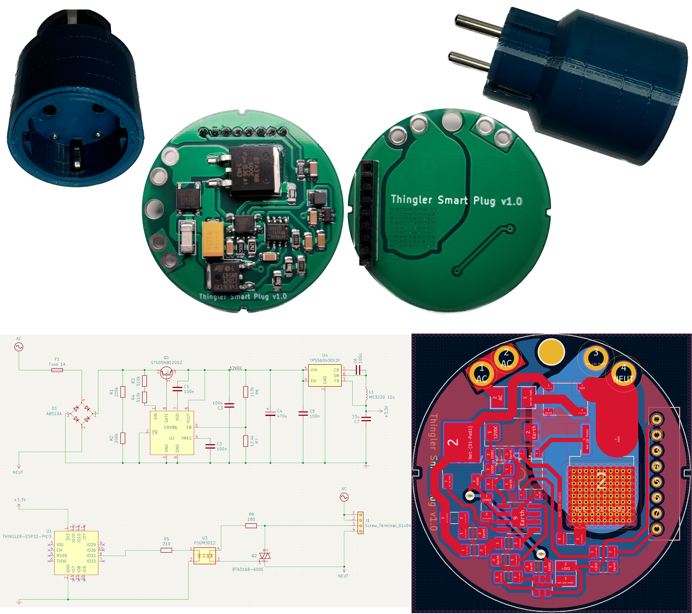

# Thingler Smart Plug

Thingler Smart Plug is a 3D printed smart plug based on the popular ESP32 micro controller. This device is using the [Thingler ESP32-PICO Module](https://github.com/thingler/esp32-pico-module).

Software has been written to either connect to the [AWS IOT service](https://github.com/thingler/smart-plug-esp32) or it can use the [Matter connectrivity standard](https://github.com/thingler/smart-plug-matter).

## Getting started

### Requirements

* [KiCad](https://www.kicad.org/download/) for the schematics
* [Thingler ESP32-PICO Module](https://github.com/thingler/esp32-pico-module)
* Either [Thingler Smart Plug Matter](https://github.com/thingler/smart-plug-matter) or [Thinger Smart Plug ESP32 (AWS IoT)](https://github.com/thingler/smart-plug-esp32) for the ESP32 module
* [3D design](https://www.tinkercad.com/things/a5thrdSu9my)

### Build

#### Disclamer

Thingler Smart Plug is provided for informational and educational purposes only. The creator of the project and its contributors are not responsible for any damages, injuries, or losses that may result from building, modifying, or using the smart plug. Users assume all risks associated with building and using the smart plug, and should take all necessary precautions to ensure their safety. By using the smart plug or any information provided in this project, users agree to hold harmless the creator and contributors of the project from any and all claims, damages, or expenses that may arise.

> :warning: **Warning: The Smart Plug is designed to work with high voltage AC power from the electrical outlet. This voltage can be dangerous and even deadly if not handled properly. Only experienced individuals with proper training and knowledge should attempt to build this smart plug. If you are not experienced or confident in your ability to work with high voltage electricity, do not attempt to build or use this device. Improper use or handling of the smart plug can result in serious injury or death. Always take appropriate safety measures and precautions when working with high voltage electricity.**

> :warning: **Warning: The circuit does not provide galvanic isolation, which means that dangerous voltages from the AC power line can be present in the circuit. Do not attempt to connect any instruments or devices to the circuit while it is connected to the AC power line.**

#### Components

The PCB can be ordered from any fabrication houses by providing the [gerber files](Gerbers). Note that the copper weight should be 2 oz.

The following components has been used for Smart Plug:

| Ref | Qty | Manufacturer Part Number | Manufacturer | Description | Product Link |
| --- | --- | --- | --- | --- | --- |
| C1, C2, C3, C5, C6 | 5 | C1206C104M5RACTU | KEMET | Multilayer Ceramic Capacitors MLCC - SMD/SMT 50V 0.1uF X7R 1206 20% | [Mouser](https://www.mouser.com/ProductDetail/KEMET/C1206C104M5RACTU?qs=sGAEpiMZZMs0AnBnWHyRQAyQ3AEn5kTUXS61cVd4nXQ%3D) |
| C4 | 1 | TPSE477K010R0050 | KYOCERA AVX | Tantalum Capacitors - Solid SMD 10V 470uF 10% 2917 ESR= 50 mOhm | [Mouser](https://www.mouser.com/ProductDetail/KYOCERA-AVX/TPSE477K010R0050?qs=sGAEpiMZZMsh%252B1woXyUXjxWZTFtyFwDuJgYiJSpALQg%3D) |
| C7 | 1 | C3216X7S0J336M160AC | TDK | Multilayer Ceramic Capacitors MLCC - SMD/SMT 1206 6.3V 33uF X7S 20% T: 1.6mm | [Mouser](https://www.mouser.com/ProductDetail/TDK/C3216X7S0J336M160AC?qs=xLDY6iXSiQZFXqsBpUFNJw%3D%3D) |
| D1 | 1 | ABS10A-13 | Diodes Incorporated | Bridge Rectifier | [Mouser](https://www.mouser.com/ProductDetail/Diodes-Incorporated/ABS10A-13?qs=5aG0NVq1C4z7Y6XEf8aBrg%3D%3D) |
| F1 | 1 | 0679H1000-01 | Bel Fuse | Surface Mount Fuse 1A 350 VAC 72 VCD | [Mouser](https://www.mouser.com/ProductDetail/530-0679H1000-01) |
| J1-1 | 1 |  | ZHNL | Europe Standard Plug Insert, can only be acquired in big quantities (or as samples) | [Alibaba](https://www.alibaba.com/product-detail/Europe-Standard-Plug-Insert-two-2_1600487104594.html) |
| J1-2 | 1 |  | ZHNL | AMD European German socket, can only be acquired in big quantities (or as samples) | [Zhnlen](http://www.zhnlen.com/en/pd.jsp?recommendFromPid=0&id=221&fromMid=827&fromColId=116), [Alibaba](https://www.alibaba.com/product-detail/German-and-serbia-Terminal-Contact-Cage_1600497363416.html) |
| L1 | 1 | ME3220-123KLC | Coilcraft | Power Inductors - SMD 12uH Unshld 10% 840mA 470mOhms | [Mouser](https://www.mouser.com/ProductDetail/Coilcraft/ME3220-123KLC?qs=sGAEpiMZZMsg%252By3WlYCkU2kWFds1hA9DbYDsvlhd31E%3D) |
| Q1 | 1 | STGD5NB120SZT4 | STMicroelectronics | IGBT Transistors N-Ch 1200 Volt 5 Amp | [Mouser](https://www.mouser.com/ProductDetail/STMicroelectronics/STGD5NB120SZT4?qs=Tj7OqeScv5KzkQtpY0oojQ%3D%3D) |
| Q2 | 1 | BTA316B-600E,118 | WeEn Semiconductors | Triacs Thyristor TRIAC 600V 150A 3-Pin (2+Tab) | [Mouser](https://www.mouser.com/ProductDetail/WeEn-Semiconductors/BTA316B-600E118?qs=6YAT8rHPFU%252BjXw0I0rTt4g%3D%3D) |
| R1, R2 | 2 | CR1206AFX-2003EAS | Bourns | Thick Film Resistors - SMD ResA-AS 1206 200k 1% 250mW TC100 | [Mouser](https://www.mouser.com/ProductDetail/Bourns/CR1206AFX-2003EAS?qs=PzGy0jfpSMsbNqkCSMTFTg%3D%3D) |
| R3, R4 | 2 | KTR18EZPF5103 | ROHM Semiconductor | Thick Film Resistors - SMD 1206 510Kohm 1% High VoltageAEC-Q200 | [Mouser](https://www.mouser.com/ProductDetail/ROHM-Semiconductor/KTR18EZPF5103?qs=DyUWGjl%252BcVuYEq26lvIerQ%3D%3D) |
| R5 | 1 | CRCW1206210RFKEA | Vishay / Dale | Thick Film Resistors - SMD 1/4watt 210ohms 1% | [Mouser](https://www.mouser.com/ProductDetail/Vishay-Dale/CRCW1206210RFKEA?qs=LOE%2FbrHKynXo3sZGow1Zgw%3D%3D) |
| R6 | 1 | CRCW120680K6FKEA | Vishay / Dale | Thick Film Resistors - SMD 1/4watt 80.6Kohms 1% | [Mouser](https://www.mouser.com/ProductDetail/Vishay-Dale/CRCW120680K6FKEA?qs=sGAEpiMZZMtlubZbdhIBIIDv3ViF%2FKZ8GQ5VYt9J%2FQI%3D) |
| R7 | 1 | CR1206-FX-1242ELF | Bourns | Thick Film Resistors - SMD 12.4K 1% | [Mouser](https://www.mouser.com/ProductDetail/Bourns/CR1206-FX-1242ELF?qs=sGAEpiMZZMtlubZbdhIBICIt3wBox2Qh6Yrjo1PMsNo%3D) |
| R8 | 1 | ERJ-8ENF1800V | Panasonic | Thick Film Resistors 1206 180ohms 1% AEC-Q200 | [Mouser](https://www.mouser.com/ProductDetail/Panasonic/ERJ-8ENF1800V?qs=sGAEpiMZZMvdGkrng054t8AJgcdMkx7xp%2FUyp6%252BxK6s%3D) |
| U1 | 1 | THINGLER-ESP32-PICO | Thingler | ESP32 module | [GitHub](https://github.com/thingler/esp32-pico-module) |
| U2 | 1 | SR086SG-G | Microchip Technology / Atmel | Switching Voltage Regulators 3.3V Adjust Off-Line Switching Regulator | [Mouser](https://www.mouser.com/ProductDetail/Microchip-Technology-Atmel/SR086SG-G?qs=ph4zPCVRuvrOCUnBv7TdAA%3D%3D) |
| U3 | 1 | FODM3012R2V-NF098 | onsemi / Fairchild | Triac & SCR Output Optocouplers MFP, 250V Random Phase Triac Output | [Mouser](https://www.mouser.com/ProductDetail/onsemi-Fairchild/FODM3012R2V-NF098?qs=0lQeLiL1qyYTpyszibB5tA%3D%3D) |
| U4 | 1 | TPS560430X3FDBVR | Texas Instruments | Voltage Regulators - Switching Regulators SIMPLE SWITCHER 36-V, 600-mA Buck Regulator With High-Efficiency Sleep Mode 6-SOT-23 -40 to 125 | [Mouser](https://www.mouser.com/ProductDetail/Texas-Instruments/TPS560430X3FDBVR?qs=sGAEpiMZZMsMIqGZiACxIY79W%2FZ1FL4F65GEfpgrgpedxebpzRnU7w%3D%3D) |

#### Printing the 3D design

The smart plug case is designed to be printed without the need for any support material. We recommend using PETG filament as it is a strong and durable material suitable for this application. Please note that in addition to the printed case, you will also need the following components to assemble the smart plug:

* 2 x M2 nuts
* 2 x M2 * 8 screws

## License

Released under [GNU/GPL Version 3](LICENSE)
